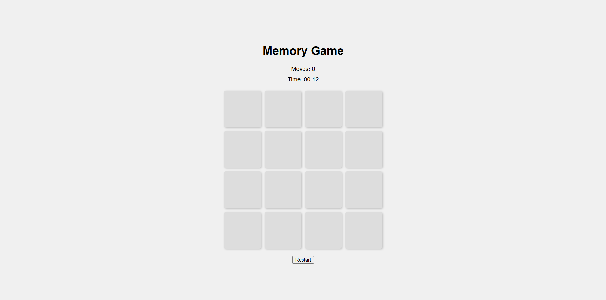
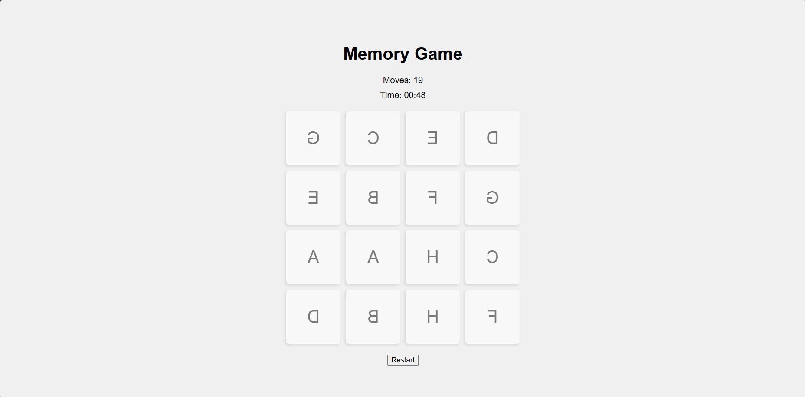

# Memory Game

This is a simple memory game built using HTML, CSS, and JavaScript. The objective of the game is to match all pairs of cards with the least number of moves and in the shortest time possible.

## How to Play

1. Click on a card to flip it over.
2. Click on another card to try and find its match.
3. If the cards match, they will remain flipped. If they do not match, they will flip back over.
4. The game ends when all pairs are matched.

## Features

- Timer to track the time taken to complete the game.
- Move counter to track the number of moves made.
- Restart button to reset the game.

## Screenshots

## Author

Shaik Abdul Munawar

[LinkedIn](https://www.linkedin.com/in/shaik-abdul-munawar-b35821284)
